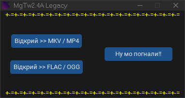

# MgTw2.4A-Legacy
Програма для швидкого об'єднання відео та аудіо без перекодування відеопотоку. Утиліта бере відео MKV або MP4, конвертує аудіо доріжку з форматів FLAC або OGG в AAC, а потім зшиває їх разом без втрати якості відео, в контейнер MP4.

ПРИМІТКА: в основному програма створювалася для створення WebRip x264+aac, але ви не обмежені відеопотоком, можете використовувати будь-який, який тільки підтримує MP4.



## 📥 Завантажити / Download

<p align="left">
  <a href="https://github.com/TBai92/MgTw2.4A-Legacy/raw/main/releases/download/MgTw2.4A-Lagacy(by-TBai92).zip">
    
  </a>
</p>

## 🚀 Як це працює

Завдяки оптимізованій збірці FFmpeg, програма працює максимально швидко:
1. Відеопотік просто копіюється (copy), що економить 99% часу та ресурсів процесора.
2. Аудіо (FLAC/OGG) декодується і кодується в ефективний формат AAC.
3. Усе пакується в готовий контейнер (MP4).

ПРИМІТКА: яке б БАГАТОКАНАЛЬНЕ аудіо ви би не використовували на виході буде Stereo 192k

## 🛠 Збірка .exe (Pyinstaller)
```bash
pyinstaller --onefile --noconsole --icon="image.ico" --name "MgTw2.4A Lagacy (by TBai92)" --add-data "image.ico;." main.py
```
## 🛠 Збірка додаткових файлів (Кастомний FFmpeg)

Для роботи програми використовується мінімалістична статична збірка FFmpeg під Windows (x64). З неї вирізано все зайве (відеодекодери, мережа, пристрої), щоб зменшити розмір кінцевого файлу програми та забезпечити ліцензійну чистоту.

### Крос-компіляція (на Linux під Windows)
Для збірки залежностей вам знадобиться інструментарій mingw-w64. Перейдіть у папку з вихідним кодом FFmpeg та виконайте конфігурацію: (збірка відбувалася на Rocky linux 8)

```bash
make clean

./configure \
  --enable-cross-compile \
  --arch=x86_64 \
  --target-os=mingw32 \
  --cross-prefix=x86_64-w64-mingw32- \
  --pkg-config=false \
  --disable-x86asm \
  --disable-pthreads \
  --enable-w32threads \
  --disable-everything \
  --disable-doc \
  --disable-network \
  --disable-devices \
  --enable-protocol=file \
  --enable-filter=aresample,aformat,null \
  --enable-demuxer=mp4,matroska,flac,ogg,mov \
  --enable-muxer=mp4,matroska,flac,ogg,ipod,mov \
  --enable-decoder=aac,vorbis,flac,opus,pcm_s32le,pcm_s24le,pcm_s16le \
  --enable-encoder=aac \
  --enable-parser=aac,vorbis,flac,opus,mpegaudio \
  --enable-bsf=aac_adtstoasc \
  --enable-small \
  --enable-static \
  --disable-shared \
  --extra-cflags="-D_WIN32_WINNT=0x0600" \
  --extra-ldflags="-static -static-libgcc"

make -j$(nproc)

```

## 🤝 Подяки / Credits

* [Вітриця](): Дизайн іконок та графічних асетів програми.
* [Overlordd](): QA / Тестування якості аудіо-конвертації.
* [Maxx Light](): Ідеї та додаткові "фічі"
